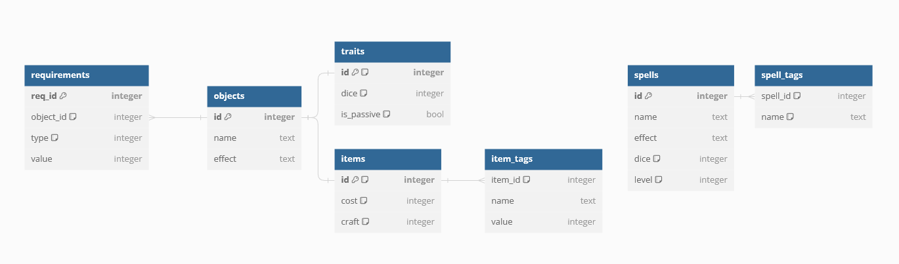

# rpg-hell-backend

the backend for the RPG Hell's website



will include:

-   Schema for MySQL database
-   FastAPI backend
-   Docker Image for everything? idk

## How to setup

1. Setup venv

```
python -m venv .venv
.venv/Scripts/activate (or) source .venv/bin/activate
```

2. Install packages

```
python -m pip install -r requirements.txt
```

3. Run API

```
uvicorn api:app --reload
```
